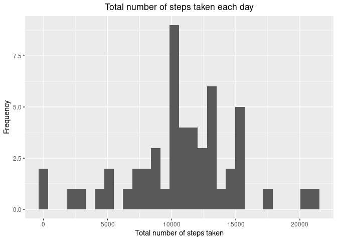
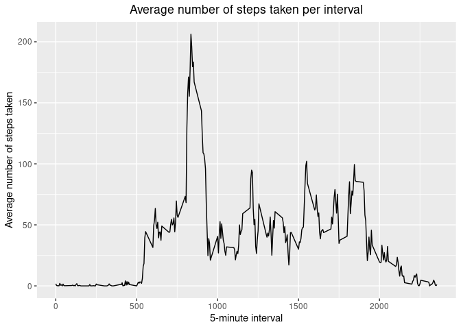
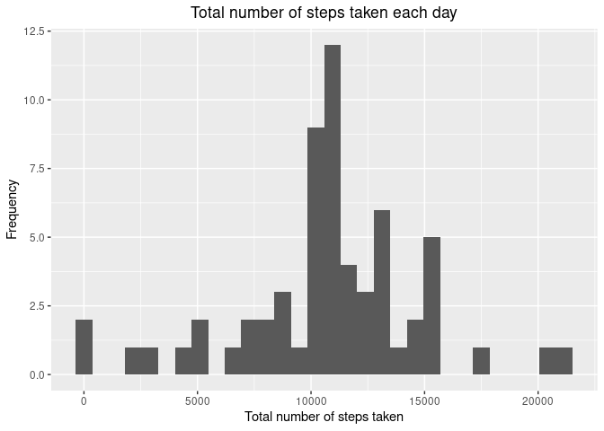
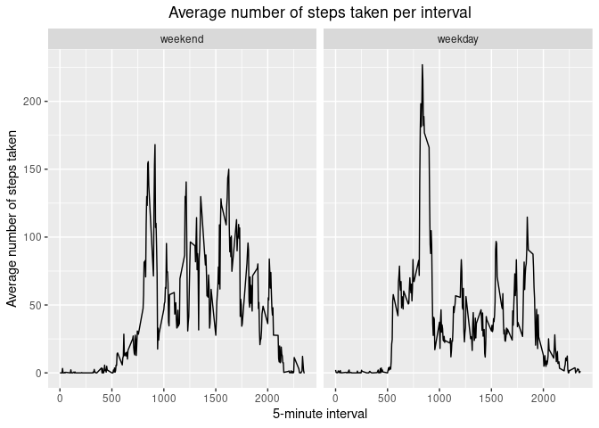

<br />  

## Load required packages      
To perform the following processes, it is necessary to have the packages below 
installed on the system. If necessary, perform the following command to 
install them `install.packages(c("readr", "dplyr", "ggplot2", "lubridate"))`.


```r
library(readr)      # read rectangular text data
library(dplyr)      # manipulate data 
library(ggplot2)    # create elegant data visualisations 
library(lubridate)  # parse and manipulate dates
```
  
<br /> 

## Loading and preprocessing the data  
Using the `read_delim` function of the `readr` package, with the possibility of 
indicating the column separator (which is not always a comma) and also easily 
indicating the data type of each column. If necessary, the data is available 
[here][datalink].

```r
activity <- read_delim(
  file = 'activity.csv',
  delim = ",",
  col_types = cols(
    steps = col_double(),
    date = col_date(format = ""),
    interval = col_double()
  )
)
```
Let's see what the data looks like.

```r
glimpse(activity)
```

```
## Rows: 17,568
## Columns: 3
## $ steps    <dbl> NA, NA, NA, NA, NA, NA, NA, NA, NA, NA, NA, NA, NA, NA, NA, …
## $ date     <date> 2012-10-01, 2012-10-01, 2012-10-01, 2012-10-01, 2012-10-01,…
## $ interval <dbl> 0, 5, 10, 15, 20, 25, 30, 35, 40, 45, 50, 55, 100, 105, 110,…
```

```r
apply(is.na(activity), 2, sum)
```

```
##    steps     date interval 
##     2304        0        0
```
We have an already tidy dataset with missing values in column `steps`.
  
<br />

## What is mean total number of steps taken per day? 
<br />
Let's calculate the total number of steps taken per day.

```r
total_steps_per_day <- activity %>% 
  group_by(date) %>%
  ## Set na.rm = TRUE to ignore missing values
  summarise(steps = sum(steps, na.rm = TRUE)) %>%  # 
  ungroup() %>%
  ## 0 steps for a whole day, this is nonsense and sounds like there 
  ## was no data collection
  filter(steps > 0)
```
<br />
Here the histogram of the total number of steps taken each day.

```r
total_steps_per_day %>%
  ggplot(aes(x = steps)) + 
  geom_histogram(bins = 30) + 
  ggtitle("Total number of steps taken each day") +
  theme(plot.title = element_text(hjust = 0.5)) +
  xlab("Total number of steps taken") + 
  ylab("Frequency")
```

<!-- -->
<br />
Mean of the total number of steps taken per day

```r
mean(total_steps_per_day$steps)
```

```
## [1] 10766.19
```
<br />
Median of the total number of steps taken per day

```r
median(total_steps_per_day$steps)
```

```
## [1] 10765
```


<br />  

## What is the average daily activity pattern?

<br />
Here a line plot showing the average number (across all days) of steps taken for 
each 5-minutes interval.

```r
activity %>% 
  group_by(interval) %>% 
  summarise(steps = mean(steps, na.rm = TRUE)) %>%
  ungroup() %>%
  ggplot(aes(x = interval, y = steps)) + 
  geom_line() + 
  ggtitle("Average number of steps taken per interval") + 
  theme(plot.title = element_text(hjust = 0.5)) +
  xlab("5-minute interval") + 
  ylab("Average number of steps taken")
```

<!-- -->

<br />
Which 5-minute interval, on average across all the days in the dataset, contains
the maximum number of steps?

```r
intervall_with_max_steps <- activity %>% 
  group_by(interval) %>% 
  summarise(steps = mean(steps, na.rm = TRUE)) %>%
  ungroup() %>%
  mutate(rank = row_number(desc(steps))) %>%
  filter(rank == 1) %>%
  select(-c(rank))
```
Interval `835` contains the maximum 
number of steps.

<br />  

## Imputing missing values
<br />
Total number of missing values in the dataset. 

```r
## Column(s) that contain(s) missing values in the dataset
col_names_with_na <- colnames(activity)[apply(activity, 2, anyNA)]
## Number of rows that contain NAs in the dataset
nrow_with_na <- max(apply(is.na(activity), 2, sum))
```
We have `2304` missing values (NAs) through 
1 column(s) ( `steps` ) 
and `2304` row(s). So, 
`13.11%` of observations
contain NAs.   

<br />
Let's say `13.11%` 
is a sizeable percentage and deal with these missing values.   
Let's try to replace each missing value by the average observed 
over the same interval during the same month.

```r
activity <- activity %>%
  mutate(month = format(date,'%Y%m')) %>% 
  group_by(month,interval) %>%
  mutate(steps = ifelse(is.na(steps),mean(steps, na.rm = TRUE),steps)) %>%
  ungroup() %>%
  select(-c(month))

## Check if there are remaining NAs
any(is.na(activity))
```

```
## [1] FALSE
```
That's it, all missing values have been processed / replaced in our original 
dataset.

<br />
Let's remake the previous histogram of the total number of steps taken each day,
but this time with the missing data filled in.

```r
total_steps_per_day <- activity %>% 
  group_by(date) %>%
  ## Set na.rm = TRUE to ignore missing values
  summarise(steps = sum(steps, na.rm = TRUE)) %>%  # 
  ungroup() %>%
  ## 0 steps for a whole day, this is nonsense and sounds like there 
  ## was no data collection
  filter(steps > 0)

total_steps_per_day %>%
  ggplot(aes(x = steps)) + 
  geom_histogram(bins = 30) + 
  ggtitle("Total number of steps taken each day") +
  theme(plot.title = element_text(hjust = 0.5)) +
  xlab("Total number of steps taken") + 
  ylab("Frequency")
```

<!-- -->
<br />
Mean of the total number of steps taken per day

```r
mean(total_steps_per_day$steps, na.rm = TRUE)
```

```
## [1] 10764.31
```
<br />
Median of the total number of steps taken per day

```r
median(total_steps_per_day$steps, na.rm = TRUE)
```

```
## [1] 10739.88
```
The mean and the median have slightly decreased following this operation of 
imputing missing data. We can conclude that the impact is really minimal.

<br />  

## Are there differences in activity patterns between weekdays and weekends?

<br />
Use of `luridate`'s `wday` function which encodes the days of the week in 
numbers to bypass language constraints. My system is on French, which is 
not the case for everyone.

```r
activity <- activity %>% 
  # mutate(weekday = weekdays(date)) %>% 
  mutate(weekpart = factor(ifelse(lubridate::wday(date) %in% c(1,7),
                                  "weekend","weekday"),
                                   levels = c("weekend","weekday")))
```
<br />
Here are line plots showing the average number (across all weekday days or 
weekend days) of steps taken for each 5-minutes interval.

```r
activity %>%
  group_by(weekpart, interval) %>% 
  summarise(steps = mean(steps)) %>%
  ungroup() %>% 
  ggplot(aes(x = interval, y = steps)) + 
  geom_line() +
  facet_wrap(~weekpart) +
  ggtitle("Average number of steps taken per interval") +
  theme(plot.title = element_text(hjust = 0.5)) +
  xlab("5-minute interval") + 
  ylab("Average number of steps taken")
```

<!-- -->

[datalink]: https://d396qusza40orc.cloudfront.net/repdata%2Fdata%2Factivity.zip

